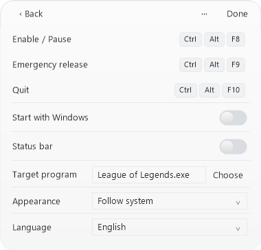
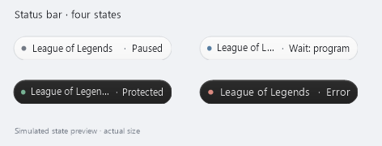
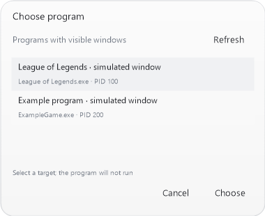

# CursorGuard 1.2.3

[Chinese](README.md) · [Build and test](BUILDING.md) · [Validation limits](docs/VALIDATION.md)

A Windows 10/11 desktop utility that confines the cursor to the valid client area of your selected foreground program. League of Legends is the default; other games or applications can be selected. The capsule window and optional floating bar display the selected program and actual state.

Version 1.2.3 adds persistent Simplified Chinese / English selection and organizes production code, tests and scripts into separate directories. Portable and complete source packages are prepared for manual validation. The main window displays the selected program's actual executable icon, with its complete basename and state in a tooltip; clicking the icon opens program selection. Icon resources are read without launching the executable. A stopped/unreadable target or missing icon uses a neutral application glyph. Icons are requested at the physical DPI size and held only in memory for the current target. Target/DPI changes, unreadable targets and exit release prior bitmaps. CursorGuard writes no icon-cache files or persistent cache directory; preferences contain the executable basename, no icon bytes. Windows Shell caching is outside this guarantee and is not modified or cleared. The floating bar retains the program basename and actual state. Waiting labels say “Wait: program”. The default target remains League of Legends.exe.

Chinese labels use installed Microsoft YaHei UI; Latin text, digits and shortcut keys use installed Segoe UI, in regular weight. Missing families fall back to the system interface font. No fonts are downloaded or bundled. Offscreen layout checks cover 125%, 150% and 200%; physical monitor DPI transitions remain unverified.

## Getting started

1. Extract the complete release ZIP to a stable folder and run `CursorGuard.exe`. Every launch starts **paused**, without elevation or driver installation.
2. Choose Settings from the gear menu, or click the main program icon to enter program selection. Settings first pauses protection and attempts release. If an owned constraint cannot be released, editing is refused and emergency shortcuts stay registered.
3. Click the target's **Choose** button. Select a running program with a visible window, select an `.exe` file, or type an executable filename. Selecting a file never launches it.
4. Save with **Done**, then explicitly enable protection with the switch or toggle shortcut.
5. Focus the selected program and move the cursor into its area yourself. Its valid window must remain stable for 100 ms before protection begins.

The picker displays window captions and PIDs only while you use it; it does not persist them. The target is saved as an executable filename, not a full path, PID or caption. Multiple instances or windows with that name are eligible only when the particular window is the actual foreground window. Other games have not been tested.

## Controls

| Default shortcut | Action |
| --- | --- |
| `Ctrl + Alt + F8` | Enable / pause |
| `Ctrl + Alt + F9` | Force emergency release and pause |
| `Ctrl + Alt + F10` | Quit |

Change shortcuts in settings, using Ctrl or Alt with a regular key. Duplicate combinations, some system keys and registration conflicts are rejected. Failed saves attempt to restore the previous settings. Global shortcuts are temporarily unregistered during editing; `Alt + F4` still closes the panel. Normal Alt+Tab away from the target releases this tool's constraint on the next background check.

Drag the main window to move it. The gear menu offers hide-to-tray without changing protection or floating visibility; finish or cancel settings editing before hiding. Double-click the tray icon to open it. The tray menu provides pause, emergency release, settings, floating visibility/reset and quit. The settings **···** menu includes hide, default shortcuts, details and quit.

## State, floating bar and appearance

Paused, waiting, protected and error states use both text and distinct icon marks. **Protected** means the core confirmed that the current cursor rectangle matches a valid target. Merely enabling the switch does not mean protection is active.

The floating bar is off by default. Enable it in settings or the tray menu. It uses the same state snapshot, shows the target name, and can be dragged. Its monitor-relative position is saved; monitor removal, work-area changes or DPI changes restore it within a visible area. Use the tray reset command if needed. Long names are ellipsized with the full executable and state in a tooltip. Nonactivation window policies are implemented; actual physical dragging and focus behavior still require manual validation. It is an ordinary topmost desktop window and may be hidden by exclusive fullscreen; it can be placed on the second monitor.

Appearance defaults to the Windows app theme, with light and dark overrides. System changes are normally polled within about one second. Tray icons independently follow the taskbar theme. High contrast uses system colors; unreadable theme settings fall back to light. CursorGuard does not change the Windows theme.

Settings use a slim rounded scrollbar with a wider hit area and no arrow buttons. Wheel, thumb drag, keyboard paging and focus reveal keep long settings accessible. The thumb is hidden when content fits; content width stays fixed.

## Language

Open **Settings → Language** and choose **English** or **Simplified Chinese**. The selection is saved immediately and restored at the next launch. Main and floating captions, owned menus, the program picker, help, errors and shortcut-conflict messages follow the choice. User executable names and real window titles keep their original text. Windows owns the native file dialog and may display its controls in the operating-system language.

The language is stored in the existing interface preferences. Older files default to Simplified Chinese while retaining valid position, appearance and visibility fields. A failed language save keeps the previous language and restores the dropdown. Language changes do not enable protection or change target/shortcut preferences.

These English previews are drawn by the application's actual English renderer using explicitly simulated states. No image text replacement or desktop capture is used.

## Startup and compatibility

Startup is off by default. Opting in writes only the current user's `HKCU\Software\Microsoft\Windows\CurrentVersion\Run\LoLMouseGuard` value. Login launches quietly to the tray and still starts paused. Saving unrelated settings preserves an existing startup path. After moving the executable, explicitly disable startup and save, then enable it and save to update that path.

Legacy paths and single-instance identity are retained: `%APPDATA%\LoLMouseGuard\settings.json` for shortcuts/target, and `floating.json` for interface preferences. Old files without the new fields default to League of Legends, system appearance and Simplified Chinese. Exit an older running version normally before launching this one; do not overwrite its active folder.

## How it works

Public Win32 APIs read foreground window identity, executable filename, client coordinates, monitor bounds and cursor position. Client coordinates are converted to physical screen coordinates and intersected with the window's monitor and virtual desktop. Negative coordinates are supported; uncertain DPI initialization blocks enabling. Moving, resizing and switching monitors trigger fresh coordinates and a new stabilization period. No manual screen coordinates are required.

An independent thread targets a 20 ms check interval. When a constraint is lost, it reapplies `ClipCursor` only if foreground identity, geometry and cursor conditions remain valid. It checks the window/PID again before applying and rechecks foreground afterwards. Focus loss, minimization, invalid geometry, pause or normal exit release this tool's rectangle. Scheduling can delay checks: 20 ms is a target, not a measured guarantee. An outside cursor is never deliberately moved back.

`ClipCursor` has no public owner identity. Normal cleanup preserves a different rectangle installed later by another application. The emergency command explicitly forces release. There is no injection, game-memory reading, input hook, anti-cheat/security modification, background networking, telemetry or automatic updater.

## Troubleshooting

- **Always waiting:** select the actual program executable, not its launcher. It must be foreground, not minimized, with the cursor inside a valid area. Tiny windows below 64 × 64 and unreadable coordinates are rejected.
- **Shortcut error:** use settings **··· → Details and help**, select an unused combination, then explicitly enable again.
- **Missing floating bar:** enable/reset it from the tray. Exclusive fullscreen can obscure desktop windows; use the second monitor if desired.
- **Stop now:** use emergency release, the tray emergency command, or normal Alt+Tab away, then quit.
- **Forced termination or OS hang:** normal cleanup cannot guarantee recovery when code cannot run.

## Development and license

Build with the existing .NET Framework compiler; no NuGet packages or external runtime are bundled. See [BUILDING.md](BUILDING.md). Project code and original icons use **GPL-3.0-only**; see [LICENSE](LICENSE) and [third-party notices](THIRD_PARTY_NOTICES.md). Copyright (c) 2026 **RAINDAYS121**. The project repository is [RAINDAYS121/CursorGuard](https://github.com/RAINDAYS121/CursorGuard); portable and matching source packages plus SHA-256 checksums are prepared for `v1.2.3`. GitHub Releases is authoritative for publication status.

Version 1.2.3 passes 132 automatic regressions, including 18 language cases. The matching source ZIP is independently extracted, rebuilt and checked with the same suite. Both packages include SHA-256 checksums; identical binary output across compiler environments is not claimed. This revision uses fake backends, hidden managed controls and offscreen drawing. Actual dropdown/picker/tray interaction, dragging, physical monitor/DPI transitions, game and anti-cheat compatibility remain unverified. See [validation details](docs/VALIDATION.md).

Production C# is under `src/`, regression code under `tests/`, PowerShell build/verify/package scripts under `scripts/`, and bilingual illustrative previews under `previews/en/` and `previews/zh-CN/`. Ordinary CI has read-only repository permissions.
