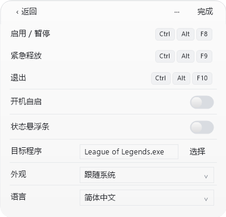
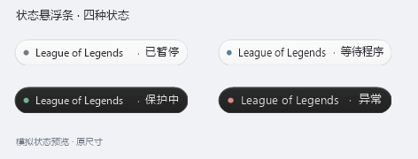
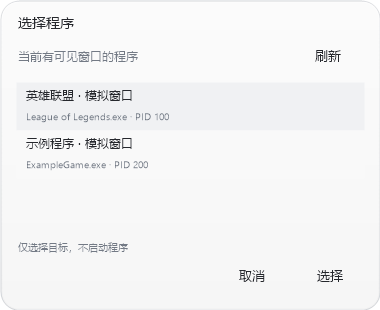

# CursorGuard · 鼠标守卫 1.2.3

[English](README.en.md) · [构建与测试](BUILDING.md) · [验证边界](docs/VALIDATION.md)

Windows 10/11 桌面工具：仅在你选择的程序处于真实前台时，将鼠标限制在该窗口的有效区域。默认目标为英雄联盟，也可选择其他游戏或应用。主窗口与悬浮条采用胶囊造型，显示目标程序和实际状态。

1.2.3 新增简体中文 / English 语言选择，并将生产源码、测试与脚本分别整理到 src、tests、scripts。提供便携程序包和完整源码包，交互与游戏表现仍待实测。主界面用所选程序的真实图标代替可见名称，点击图标进入程序选择，悬停显示完整进程本名和状态。通过只读进程路径及 EXE 图标资源提取图标，不运行目标程序；目标未运行、路径不可读或没有图标时显示统一中性应用图标。图标按 DPI 请求对应像素尺寸，后台刷新，仅在内存保留当前目标所需位图；切换目标/DPI、目标不可读或退出时及时释放。不写图标文件，不建立持久图标缓存目录；配置只保存程序文件名，不保存图标字节。Windows 自身 Shell 缓存不由本工具控制或清理。悬浮条保留程序本名和真实状态；通用等待文案为“等待程序”。默认目标仍为 League of Legends.exe。

中文使用系统已安装的 Microsoft YaHei UI，拉丁字母、数字和快捷键使用 Segoe UI，均为常规字重；缺少字体时回退到系统界面字体。不下载或打包字体。125%、150%、200% 缩放已进行离屏布局检查，真实显示器 DPI 切换仍待人工验证。

## 使用

1. 将发行 ZIP 完整解压到固定目录，运行 `CursorGuard.exe`。启动始终保持暂停；无需管理员权限，也不会安装驱动。
2. 点齿轮菜单中的“设置”，或点击主界面程序图标进入程序选择。进入设置会先暂停并尝试释放本工具的限制；若本工具持有的限制无法释放，将保留紧急快捷键并拒绝编辑。
3. 在“目标程序”旁点“选择”：从有可见窗口的运行中程序选择，或选择 `.exe` 文件。选择文件只取得文件名，不会运行它。也可直接输入完整可执行文件名。
4. 点“完成”保存，再手动打开主窗开关或按启用快捷键。选择目标或保存设置不会自动启用保护。
5. 切回目标程序，并让鼠标自行进入游戏区域。窗口有效且稳定 100 毫秒后才开始保护。

程序选择窗口中的标题和 PID 只供本次选择查看，不会保存。配置保存的是可执行文件名，例如 `League of Legends.exe`，不是路径、PID 或窗口标题。若多个进程或窗口具有相同可执行文件名，则保护其中**实际处于前台**的有效窗口；不会同时锁住多个窗口。其他游戏是否兼容尚未实测。

## 操作

| 默认快捷键 | 作用 |
| --- | --- |
| `Ctrl + Alt + F8` | 启用 / 暂停 |
| `Ctrl + Alt + F9` | 紧急释放并暂停 |
| `Ctrl + Alt + F10` | 退出 |

快捷键可在设置中修改，至少使用 Ctrl 或 Alt 加普通按键。重复组合、部分系统切换键及注册冲突会被拒绝；保存失败会尝试恢复旧设置。编辑设置时全局快捷键暂时注销，主窗 `Alt + F4` 仍可退出。正常 `Alt + Tab` 切出目标后，后台下一次检查会释放本工具的限制。

主窗口可拖动。齿轮菜单提供“隐藏主界面到托盘”；隐藏不改变保护或悬浮条状态。设置编辑期间先完成或返回，再隐藏。暂停、退出和紧急释放也可从托盘菜单操作；双击托盘图标打开面板。

## 实际状态与悬浮条

暂停、等待、保护、异常同时使用文字和不同图标标记。只有核心确认当前限制区域等于有效目标区域时才显示“保护中”。打开开关但程序不在前台、窗口尚未稳定或鼠标还在区域外时，会显示等待。

悬浮条默认关闭，在设置或托盘菜单中开启。它显示目标名称和同一份实际状态，可拖动，保存显示器及相对位置；显示器移除、工作区或 DPI 改变时自动恢复到可见范围，托盘菜单也可重置位置。长名称省略，悬停查看完整进程名和状态。悬浮窗使用不激活的窗口样式；真实拖动和焦点行为仍待人工验证。它是普通桌面置顶窗口，**不保证覆盖独占全屏**，可放在副屏。

## 语言

打开“设置 → 语言”，选择“简体中文”或“英语”。选项立即保存，下次启动恢复；主界面、悬浮条、菜单、程序选择、提示与快捷键冲突说明随之切换。实际程序名和真实窗口标题保留原文。系统原生文件选择对话框的按钮由 Windows 决定，可能仍跟随系统语言。

语言保存在原有 floating.json。旧配置默认中文，并保留已有位置、外观和悬浮条开关；保存失败时保持原语言并恢复下拉选项。语言切换不改变目标、快捷键或保护状态。

预览由真实客户端绘制代码在明确的模拟状态下生成；中英文分别输出，没有替换图片文字或抓取当前桌面。

## 外观和自启

外观默认跟随 Windows 应用主题，也可选浅色或深色。系统变化通常在约一秒内刷新；托盘图标单独跟随任务栏主题，因为任务栏与应用主题可不同。高对比模式使用系统颜色；主题读取失败时回退到浅色。工具不会修改 Windows 主题。

开机自启默认关闭。启用后只设置当前用户的 `HKCU\Software\Microsoft\Windows\CurrentVersion\Run\LoLMouseGuard`，登录后收起到托盘且仍暂停。修改其他设置不会改写既有自启路径；移动程序后，如需更新自启路径，请手动关闭并保存，再开启并保存。

为兼容旧版，配置仍在 `%APPDATA%\LoLMouseGuard\settings.json`；界面偏好在同目录的 `floating.json`。旧配置缺少目标或外观字段时，分别使用英雄联盟和跟随系统。旧版与新版共用单实例标识，请先正常退出旧版再启动新版。不要在已运行的旧版目录直接覆盖文件。

## 原理与自动坐标

工具通过公开 Win32 接口读取前台窗口、进程文件名、窗口客户区、显示器边界和鼠标位置。客户区转换为屏幕物理坐标，再与所在显示器及虚拟桌面求交；支持负坐标，DPI 初始化无法确认时禁止启用。移动、缩放或跨屏后重新读取坐标并等待稳定，用户无需输入坐标。

独立后台线程目标每 20 毫秒检查一次。限制丢失后，前台、坐标和鼠标条件仍有效才重新调用 `ClipCursor`。调用前重新检查窗口和 PID，调用后复核前台；焦点切出、最小化、区域失效、暂停或正常退出时释放。本机调度可能延迟检查，20 毫秒是目标周期，并非实测保证。鼠标已在区域外时只等待，不主动拉回。

`ClipCursor` 没有公开的所有者身份。普通释放会保留其他应用后来设置的不同矩形；紧急释放是用户明确触发的强制释放。工具不注入、不读游戏内存、不挂钩键盘鼠标、不修改反作弊或系统安全设置，也没有后台联网、遥测或自动更新。

## 故障排查

- **一直等待**：检查目标是否为真正的程序 `.exe` 而非启动器；目标必须在前台、非最小化，鼠标在有效区域内。窗口小于 64 × 64 或读取失败时不会限制。
- **快捷键异常**：从设置“··· → 详情与帮助”查看原因，换一个组合。编辑结束后重新手动启用。
- **悬浮条看不到**：从托盘开启并重置位置；独占全屏可能遮住桌面窗口。使用副屏不需要关闭任何显示器。
- **需要立即停止**：按紧急释放快捷键或托盘“紧急释放并暂停”；也可正常 Alt+Tab 切出，然后退出工具。
- **异常退出或系统卡死**：正常退出的清理机制无法对强制终止、操作系统挂起作保证；保持正常系统切换入口。

## 开发与许可

使用系统自带 .NET Framework 编译器；无 NuGet 包或外部运行时捆绑。构建、模拟测试及预览见 [BUILDING.md](BUILDING.md)。项目代码和原创图标采用 **GPL-3.0-only**，完整文本见 [LICENSE](LICENSE)，第三方情况见 [THIRD_PARTY_NOTICES.md](THIRD_PARTY_NOTICES.md)。项目版权署名为 **RAINDAYS121（2026）**，仓库目标为 [RAINDAYS121/CursorGuard](https://github.com/RAINDAYS121/CursorGuard)。程序包、对应完整源码包及 SHA-256 校验按 `v1.2.3` 提供，发布状态以 GitHub Releases 为准。

1.2.3 通过 132 项自动检查，其中 18 项覆盖语言保存、兼容、切换、保存失败回退与四种缩放的双语布局。最终源码包经独立解压、重建并执行同一套检查；两种 ZIP 均附 SHA-256。检查使用模拟后端、隐藏托管控件和离屏绘制。真实下拉、程序选择、托盘、拖动、显示器 DPI 切换、游戏及反作弊兼容性仍未实测。[验证详情](docs/VALIDATION.md)。

生产源码在 `src/`，回归测试在 `tests/`，构建、验证和打包脚本在 `scripts/`，双语预览在 `previews/en/` 与 `previews/zh-CN/`。普通 CI 保持仓库只读权限。
